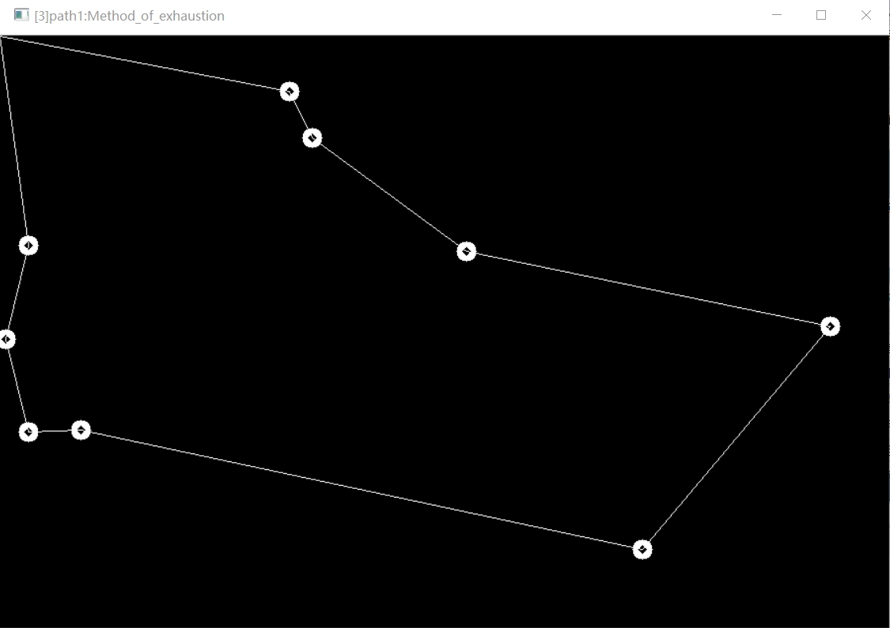

> 机器人路径规划算法

* Kramdown table of contents
{:toc .toc}
# 旅行商TSP问题

Created 2017.11.01 by William Yu; Last modified: 2018.07.21-V1.0.1

Contact :[windmillyucong@163.com](mailto:windmillyucong@163.com)

Copylift! 2018 William Yu. Some Rights Reserved.  

------

## Description

#### 效果展示

## Contributing / Contact

Have anything in mind that you think is awesome and would fit in this blog? Feel free to send a pull request.

Feel free to [contact me](mailto:windmillyucong@163.com) anytime for anything.

-----

## License

